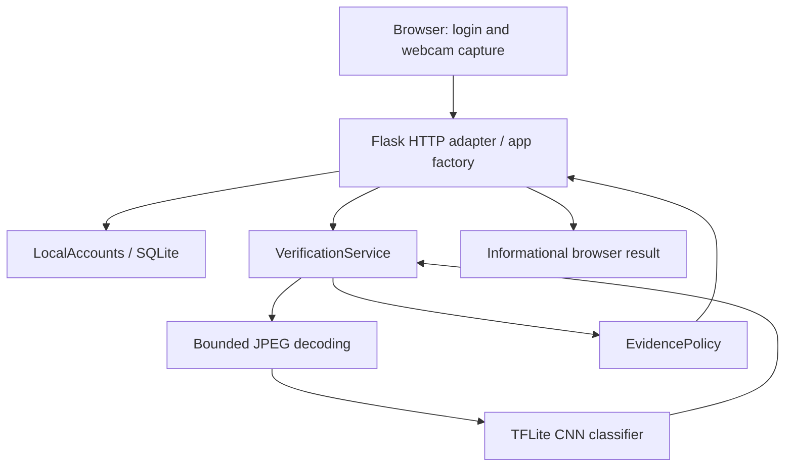
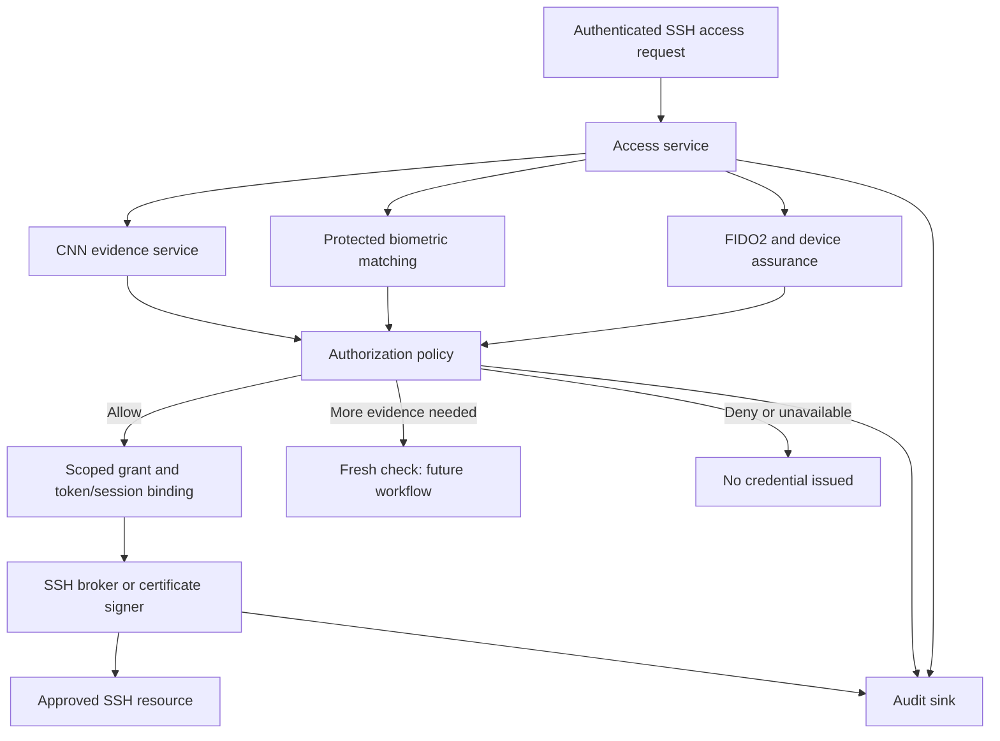

# ZTA PAM System — Design and Extension Guide

**Reviewed:** September 17, 2026  
**Active project:** `/Users/mikesimmons/Documents/zta_project`  
**Scope:** Current CNN webcam prototype and a proposed path to the full research system.

This is a standalone guide to the application: how it works, what each module owns, how to run and test it, and where the remaining research layers should be added. Future module names and interfaces below are proposals, not existing implementations.

## Contents

1. [Purpose and implementation status](#1-purpose-and-implementation-status)
2. [Current architecture](#2-current-architecture)
3. [Module reference](#3-module-reference)
4. [Current request and capture flow](#4-current-request-and-capture-flow)
5. [API, configuration, and stored data](#5-api-configuration-and-stored-data)
6. [Running and testing](#6-running-and-testing)
7. [Target research architecture](#7-target-research-architecture)
8. [Biometric hash layer](#8-biometric-hash-layer)
9. [FIDO2, TPM, and session tokens](#9-fido2-tpm-and-session-tokens)
10. [Authorization and SSH access](#10-authorization-and-ssh-access)
11. [Contracts, persistence, and audit](#11-contracts-persistence-and-audit)
12. [Implementation roadmap and acceptance tests](#12-implementation-roadmap-and-acceptance-tests)
13. [Maintenance, limitations, and open decisions](#13-maintenance-limitations-and-open-decisions)
14. [Sources and review record](#14-sources-and-review-record)

## 1. Purpose and implementation status

The goal is to authorize and audit narrowly scoped, time-limited privileged access. SSH is the selected prototype resource. The current application is a local account login and webcam media-analysis harness; it does not yet issue SSH credentials or make access decisions.

The intended research layers are:

1. **CNN media check:** gather evidence about synthetic video.
2. **Biometric hash / protected biometric matching:** compare a fresh sample with the enrolled account holder.
3. **TPM-backed FIDO2 authentication and session binding:** establish possession of an approved credential and bind the authentication to the access workflow.

The first layer exists. The latter two are research requirements supplied by the project owner; the checked-in brief does not yet define their algorithms, enrollment procedures, hardware assumptions, or token format. This document proposes integration boundaries without claiming those unresolved details are finalized.

| Capability | Status |
| --- | --- |
| Local username/password accounts | Implemented; operator creates accounts through a CLI command |
| Live webcam JPEG capture | Implemented; microphone disabled |
| CNN inference | Implemented through a local TFLite model |
| Rolling evidence and capture expiry | Implemented in process memory |
| Account-linked capture ownership | Implemented through a per-login owner identifier |
| Biometric enrollment, matching, and protected templates | Planned |
| Explicit liveness challenge and camera-injection defenses | Not implemented |
| FIDO2 registration/assertions and TPM assurance | Planned |
| Dedicated access tokens, authorization, and SSH broker | Planned |
| Automatic request for another check | Requested behavior, explicitly deferred |
| Durable audit, centralized revocation, and multi-worker storage | Not implemented |

A model label of `real` means only that the model classified one frame that way. It does not establish the person's identity, prove live capture, or authorize SSH.

## 2. Current architecture

The application is a **modular single-process application**. Modules have distinct responsibilities but run together, avoiding the operational complexity of separate services at this stage.



The decoder is called by the classifier adapter; the diagram shows data flow rather than direct Python imports. `domain.py` defines the shared result types used by the service, classifier, and policy.

The key boundaries are:

- **Transport:** browser interactions, HTTP parsing, cookies, CSRF, and response formatting.
- **Application workflow:** capture lifecycle, ownership, expiry, and coordination.
- **Inference:** image preprocessing and CNN execution.
- **Evidence calculation:** rolling counts and thresholds.
- **Account persistence:** credential storage and password checking.

The evidence policy does not grant access. Future authorization belongs in a separate policy module.

## 3. Module reference

Paths in this section are relative to the project root.

| File | Main objects or functions | Responsibility and extension boundary |
| --- | --- | --- |
| `zta/__main__.py` | `create_app()` invocation | Starts the development server on `127.0.0.1:8083`, without debug mode |
| `zta/__init__.py` | Package marker | Defines the application package |
| `zta/domain.py` | `Label`, `Status`, `Prediction`, `Evidence`, `FrameClassifier` | Framework-independent data contracts; add distinct future evidence contracts rather than overloading media labels |
| `zta/policy.py` | `EvidencePolicy` | Validates evidence settings and calculates rolling media statistics; keep access authorization elsewhere |
| `zta/service.py` | `VerificationService`, `CaptureSession` | Owns capture IDs, ownership checks, lifetime, capacity, classifier calls, and evidence windows |
| `zta/adapters/images.py` | `decode_frame()` | Decodes JPEG bytes, bounds pixel count, handles decompression warnings, and converts to RGB |
| `zta/adapters/tflite.py` | `TFLiteFrameClassifier` | Lazily loads the CNN, preprocesses input, serializes interpreter use, and translates output into a prediction |
| `zta/adapters/__init__.py` | Package marker | Groups replaceable external/runtime adapters |
| `zta/accounts.py` | `LocalAccounts` | Creates/checks local accounts using SQLite and Werkzeug password hashing |
| `zta/web/__init__.py` | `create_app()` and route handlers | Constructs dependencies; implements HTTP routes, signed session cookies, CSRF, error mapping, and account CLI |
| `zta/web/templates/index.html` | Login and webcam page | Displays login or signed-in capture controls |
| `zta/web/static/app.js` | `api()`, `stop()`, `sendFrame()`, event handlers | Captures images, calls the server, displays evidence, and shuts down the camera |
| `zta/web/static/app.css` | Page styles | Visual presentation only |
| `tests/test_pipeline.py` | Service/policy tests | Tests window behavior, ownership, expiry, capacity, errors, and model-version resets |
| `tests/test_adapter.py` | Decoder/adapter tests | Tests malformed input, wrong image format, and unavailable model behavior |
| `tests/test_web.py` | Flask test-client tests | Tests authentication, CSRF, capture isolation/restart, limits, and CNN-only API behavior |

### Shared contracts

`Prediction` contains a `label` (`real` or `fake`) and `model_id`. The latter is a SHA-256 fingerprint of the CNN model file, not a biometric hash.

`Evidence` contains `status`, `sample_count`, `fake_count`, `fake_ratio`, `window_size`, and `model_id`. `fake_ratio` is the fraction of frame labels marked fake; it is **not a calibrated probability or confidence score**.

`FrameClassifier` specifies `classify(encoded_image: bytes) -> Prediction`. An implementation returns a result or raises an exception. It must not turn unavailable inference into a successful result.

### Supporting files

- `models/lighter_quant_model.tflite`: the active CNN artifact.
- `models/deepfake_voice_detector_v2.tflite`: retained audio artifact; not loaded by the current application.
- `SOURCE_MANIFEST.json`: source/destination paths and checksums for retained copied assets. It is provenance bookkeeping, not a runtime integrity check or authentication mechanism.
- `requirements.txt`: Flask, NumPy, and Pillow.
- `requirements-inference.txt`: base requirements plus TensorFlow. The adapter can also use `tflite_runtime` if separately available.
- `requirements-macos-py312.lock.txt`: pinned dependency snapshot for the tested environment.
- `docs/`: project brief, decisions, questions, research, ideas, and session records.
- `AGENTS.md`: project working rules, including distinguishing validated facts from proposals.

## 4. Current request and capture flow

### 4.1 Account authentication

1. Visiting `/` renders the page and initializes a CSRF token in the signed Flask session.
2. The browser posts username/password JSON to `/api/login` with the CSRF header.
3. `LocalAccounts.authenticate()` reads the stored hash and checks the password.
4. Successful login replaces the session contents with the username, a fresh CSRF token, and a random `capture_owner` value. The session is marked permanent with a configured 30-minute lifetime.
5. The browser reloads to obtain the signed-in page and updated CSRF token.

Accounts are created with the CLI, not a public registration endpoint. Usernames are bounded ASCII letters/digits plus `.`, `_`, and `-`; passwords must be 12–256 characters in the current active code.

### 4.2 Webcam and inference

1. Start requests browser camera permission, preferring 640×480 video with no audio.
2. The camera stream is attached to the preview element.
3. `POST /api/captures` creates a server-generated capture ID for this login owner. A previous capture referenced by the session is stopped first.
4. A canvas copies the current video image and encodes it as JPEG at quality `0.8`.
5. The browser posts JPEG bytes to `/api/captures/<key>/frames`.
6. The service checks ownership and expiry, invokes the classifier, and checks expiry again after inference.
7. The adapter validates/decodes the image, loads the model on first use, resizes to its required dimensions, prepares the tensor, and executes inference.
8. The service records the label and asks `EvidencePolicy` to calculate the current result.
9. The browser displays counts/status, waits 200 ms, and requests the next frame.

The CNN accepts one image tensor. The observed artifact uses input shape `[1, 224, 224, 3]` and output `[1, 1]`. The adapter supports channel-first/channel-last RGB layouts and supported integer/float input mappings. Quantized output is dequantized before thresholding. Input preprocessing and class semantics still require validation against training data.

### 4.3 Evidence window and latency

The default window contains the latest **75 successful predictions**. Before it is full, status is `collecting`. At capacity:

- At least 70% fake labels produces `flagged` (at least 53 of 75).
- A lower ratio produces `below_threshold`.
- Further frames replace the oldest labels. Status can change as the window moves.

The policy is not a permanent latch, and it does not initiate a retry or access revocation. Failed inference does not add a label. If a classifier returns a different model version, the service clears the old window before appending the new result.

Sampling is response-driven, not a fixed five-fps clock:

```text
Approximate sample interval = capture/encode + request/inference/response + 200 ms
Approximate first full window = 75 × processing time + 74 × 200 ms
```

The first frame is not preceded by the timer. Browser scheduling, camera readiness, and load add variation. The approximately 15-second minimum is not a measured end-to-end guarantee. The earlier discussion of a 100 ms delay was a proposal; the current code still uses 200 ms.

### 4.4 Stop, expiry, and concurrency

Stop cancels sampling, increments a browser `generation` counter, turns off camera tracks, and deletes the server capture. The counter prevents old asynchronous responses from updating a newer run. Logout stops the current capture before clearing the login session.

Leaving the page turns off the camera; it does not guarantee an HTTP delete. Server capture expiry handles abandoned state on subsequent service access.

The service has a fixed five-minute capture lifetime and a default maximum of 32 captures. Expiry is measured from creation, not extended per frame. A service-wide lock serializes submissions, including inference; the adapter also locks its interpreter. This is simple and predictable but limits concurrent throughput.

## 5. API, configuration, and stored data

### HTTP interface

Every mutating request needs the `X-CSRF-Token` header, including login. Capture and logout routes also require a signed-in session.

| Method and path | Input | Result |
| --- | --- | --- |
| `GET /` | Session cookie, if present | Login or webcam HTML |
| `POST /api/login` | Username/password JSON | Authenticated session, or 401 |
| `POST /api/logout` | No body required | Stops the referenced capture; clears session; 204 |
| `POST /api/captures` | No body or JSON object | New capture ID; 201. A `model` field is rejected |
| `POST /api/captures/<key>/frames` | `image/jpeg` bytes | Evidence JSON |
| `DELETE /api/captures/<key>` | No body required | Deletes the owned capture; 204 |

Error mappings include invalid/empty input (400), failed authentication (401), CSRF failure (403), unknown/expired/other-owner capture (404), oversized body (413), incorrect media type (415), capture capacity (429), and unavailable model (503).

### Configuration points

| Setting | Current value or source | Where to change it |
| --- | --- | --- |
| Signing key | `ZTA_SECRET_KEY` or random at startup | Environment |
| Secure cookie flag | Enabled when `ZTA_SECURE_COOKIES=1` | Environment; requires HTTPS deployment |
| Session cookie | HttpOnly, SameSite Strict | App factory configuration |
| Session lifetime | 30 minutes; Flask permanent-session semantics | App factory; not a dedicated absolute PAM session timeout |
| Account database | `instance/accounts.db` | `DATABASE` app config |
| CNN artifact | `models/lighter_quant_model.tflite` | `MODEL_PATH` app config |
| Evidence size/threshold | 75 / 0.70 | `WINDOW_SIZE`, `FAKE_THRESHOLD` app config |
| Request body limit | 512 KiB | `MAX_CONTENT_LENGTH` app config |
| Image pixel limit | 2,073,600 pixels | Decoder constant; an area limit, not independent width/height limits |
| Capture lifetime/capacity | 300 seconds / 32 captures | Service constructor; not currently exposed as app settings |
| Sampling delay | 200 ms after completion | `app.js`, `sendFrame()` |
| Bind address/port | `127.0.0.1:8083` | `zta/__main__.py` |

Configuration passed to `create_app(config=...)` overrides app defaults. `classifier=` and `accounts=` inject replacement objects for tests or later integrations.

### Current storage and trust boundaries

SQLite stores usernames and password hashes. Signed browser cookies carry login/capture metadata; signing protects integrity but does not encrypt their contents. In-memory captures store an owner identifier, deadline, labels, and model version. Images are processed transiently; the application does not save raw frames.

Current sessions are not JWT access tokens. Clearing the browser cookie at logout is not centralized revocation of every previously copied cookie. Restarting with a random signing key invalidates existing sessions. A browser-submitted JPEG remains untrusted input even after account authentication.

## 6. Running and testing

Run these commands from the active project root:

```sh
cd /Users/mikesimmons/Documents/zta_project
python3.12 -m venv .venv-inference
.venv-inference/bin/python -m pip install -r requirements-inference.txt
.venv-inference/bin/python -m flask --app zta.web:create_app create-user mike
.venv-inference/bin/python -m zta
```

If the environment and account already exist, run only the final command. Open `http://127.0.0.1:8083`, sign in, allow camera access, and start a check. The password is entered at the CLI prompt, not placed in command history.

For the exact recorded dependency versions, use the platform-specific lock file in a compatible Python 3.12 environment. A smaller test environment can install `requirements.txt` and use injected classifiers:

```sh
python3.12 -m venv .venv
.venv/bin/python -m pip install -r requirements.txt
.venv/bin/python -m unittest discover -s tests -v
node --check zta/web/static/app.js
```

Previously completed validation for the CNN-only change: **15 tests passed**, JavaScript syntax passed, and the real CNN produced a label for a generated JPEG. This document-writing task does not rerun those checks or claim accuracy certification. Physical webcam permission/capture still needs manual browser validation.

## 7. Target research architecture

Keep the present modules as the media subsystem. Add a higher-level coordinator so `VerificationService` does not become responsible for biometrics, credentials, policy, and SSH simultaneously.

The following is a **proposed** structure; new paths are not yet implemented:

```text
zta/
  domain.py                    shared types; extend or split as contracts grow
  service.py                   existing CNN capture workflow
  policy.py                    existing media evidence calculation
  adapters/                    existing CNN and image decoder
  accounts.py                  existing prototype account adapter
  access/
    service.py                 coordinates the complete privileged-access request
    contracts.py               request, evidence-reference, and decision types
  biometrics/
    service.py                 enrollment and fresh-sample verification
    contracts.py               protected-template and match result interfaces
    adapters.py                replaceable feature/matching/protection algorithms
  authentication/
    fido2.py                   registration and authentication ceremony adapter
    attestation.py             approved device/TPM evidence policy
    tokens.py                  application token/session lifecycle
  authorization/
    policy.py                  pure allow/deny/recheck decision logic
  ssh/
    broker.py                  executes an authorized SSH grant
    signer.py                  isolated certificate-signing adapter, if chosen
  persistence/
    repositories.py            user, template, challenge, evidence, grant storage
  audit/
    events.py                  structured audit event contract and writer
  web/
    __init__.py                composition root; assemble dependencies
    ...                        route groups and browser interactions
```

Introduce each package when its functionality is implemented. Do not create empty layers merely to match the tree. Protocols, injected adapters, and pure decision functions provide modularity without requiring separate deployed services.



The diagram shows logical dependencies, not a requirement to run checks concurrently. Ordering should follow measured latency, evidence freshness, and enrollment requirements.

## 8. Biometric hash layer

### Purpose and placement

Put enrollment and comparison in `biometrics/service.py`; isolate the algorithm behind contracts in `biometrics/contracts.py` and an implementation in `biometrics/adapters.py`. Keep it separate from `FrameClassifier`, which answers a different question.

The research term **biometric hash** requires a precise definition. An ordinary SHA-256 hash of a camera image or floating-point embedding cannot directly match varied captures of the same person. The design needs a noise-tolerant comparison and a chosen template-protection scheme. A face embedding is not automatically a protected hash, and encrypting it at rest does not prove irreversibility or unlinkability.

NIST describes biometric comparison as probabilistic and requires additional authentication factors in its authentication model. This supports treating matching as one input to the access decision. [NIST biometric guidance](https://pages.nist.gov/800-63-4/sp800-63b/authenticators/#use-of-biometrics)

### Proposed enrollment and verification

Enrollment should bind multiple quality-checked samples to a verified account through an authorized enrollment ceremony. The component creates a versioned protected reference, stores it through a repository, and returns an opaque template ID. Enrollment authorization is essential: merely logging in and submitting a face must not silently replace another person's reference.

Verification should retrieve the account's reference, evaluate a fresh sample, and return a typed result with method/version, threshold, quality outcome, timestamp, and template version. The access coordinator binds that result to the account, login, capture, and access request. A poor sample or absent template should produce an explicit inconclusive/enrollment-required outcome.

Algorithm choices such as cancellable transforms or fuzzy-extractor-based schemes remain research candidates, not selected implementations. Evaluate leakage, repeatability, matching errors, re-enrollment, and recovery before selecting one. Store protection keys separately from database records.

### Integration details

- Reuse validated image decoding through an explicit adapter boundary; do not make the biometric component call the CNN's private methods.
- Define whether matching uses a selected frame, several samples, or a challenge sequence.
- CNN preprocessing currently analyzes resized full frames; face detection/alignment is a separate required design for matching.
- A hash over an accepted evidence record can bind that record to a later challenge, but it does not solve biometric matching or prove the capture was genuine.
- Never place raw templates or embeddings in browser cookies, URLs, general logs, or access tokens.

## 9. FIDO2, TPM, and session tokens

### Separate the three responsibilities

1. **FIDO2/WebAuthn authentication:** verify proof from an enrolled credential.
2. **TPM/device assurance:** determine whether the credential/device meets the research hardware requirement.
3. **Application session/access token:** represent the server's resulting session or grant.

WebAuthn uses browser-mediated registration and challenge-response assertions. Its TPM attestation format concerns authenticator evidence; a successful assertion is not itself an application session token. A platform authenticator setting alone does not prove the particular hardware assurance this project requires. Use the standard's verification procedures and a maintained server library rather than custom signature handling. [WebAuthn specification](https://www.w3.org/TR/webauthn-3/)

### Proposed module responsibilities

`authentication/fido2.py` owns credential registration/authentication and server-side challenge consumption. Browser code calls `navigator.credentials.create()` or `navigator.credentials.get()` using options obtained from the server. Store the credential public key and identity binding; private authenticator keys do not belong in Flask or SQLite.

`authentication/attestation.py` evaluates device evidence against the approved-device policy. Establish what counts as TPM-backed on supported clients and what to do when acceptable attestation is unavailable. Do not assume the current Mac development machine demonstrates a Windows/Linux TPM requirement. Distinguish key provenance from continuous device-health attestation; the latter is a separate integration if required.

`authentication/tokens.py` owns token/session issuance, expiry, rotation, validation, and revocation. Prefer an opaque server-side session initially unless distributed verification requires a signed token. Bind any grant to its subject, intended recipient, request, resource, privilege, expiry, and credential/evidence references. A signature alone does not prevent a stolen bearer token from being replayed.

### Resolve “TPM-signed FIDO2 session token” before implementation

Two materially different designs are possible:

- **Recommended interpretation for the prototype:** a TPM-backed credential authenticates a server challenge; after all checks and authorization, the server creates its own short-lived application grant.
- **Literal custom TPM-signed token:** a separate device signing operation attests to defined session/request data. This requires a protocol, key provisioning and trust model, and potentially a native client agent. It is not automatically supplied by browser FIDO2.

This is an architectural choice to confirm, not a reason to implement both. If the literal construction is required by the research, isolate it behind a device-proof adapter without changing CNN inference.

A proposed challenge record should reference the immutable request and accepted evidence IDs on the server, expire quickly, and be consumed once. This binds the ceremony to the workflow; it does not cryptographically prove that camera pixels originated from a trusted sensor.

## 10. Authorization and SSH access

`authorization/policy.py` should be a pure decision function over authenticated identity, evidence, resource policy, and approval state. `zta/policy.py` remains the CNN-window calculator.

Suggested outcomes are `allow`, `deny`, `recheck_required`, and `unavailable`. Missing, expired, mismatched, or errored evidence cannot yield an allow decision. A recheck is a new bounded attempt, not automatic approval or an endless retry loop. Retry policy remains deferred.

`access/service.py` should validate that all evidence belongs to the same user/request and remains fresh, then call authorization and coordinate issuance. Record the policy version and evidence references so a later audit can explain the decision.

`ssh/broker.py` acts only on an approved server-side grant. It should not accept a client-provided `allowed=true` or derive permission directly from `below_threshold`.

For a certificate-based implementation, OpenSSH supports signed user certificates with principals and validity intervals; target servers must be configured to trust the relevant CA and enforce allowed principals. The application token is not itself an SSH credential. A short certificate lifetime limits new authentication opportunities; it should not be assumed to terminate an already established session. [OpenSSH certificate operations](https://man.openbsd.org/ssh-keygen), [server authorization settings](https://man.openbsd.org/sshd_config)

Before choosing certificates versus a brokered connection, define allowed hosts, OS accounts, roles, maximum duration, command restrictions, approval requirements, and active-session termination behavior. Keep CA/private signing keys out of the web and inference process. Make issuance idempotent so retries cannot produce untracked grants.

## 11. Contracts, persistence, and audit

The following records are proposed; current `Evidence` does not contain these bindings.

| Record | Essential proposed fields | Owning component |
| --- | --- | --- |
| Access request | ID, subject ID, login/session ID, SSH target, principal, purpose, requested duration, creation/expiry | Access service |
| Media evidence reference | ID, capture/request/subject binding, model and preprocessing versions, window configuration, outcome, time interval | Media service/repository |
| Biometric result | ID, request/subject binding, reference version, method, quality, match outcome, expiry | Biometric service |
| Credential/device result | Credential ID, subject/request binding, consumed challenge reference, verification and assurance results, time | Authentication service |
| Authorization decision | Request/evidence references, outcome, reason codes, policy version, validity | Authorization policy/repository |
| SSH grant | Decision ID, target, principal, scope, credential/certificate ID, expiry, status | Broker/repository |

Use immutable IDs for subjects in the future rather than making mutable usernames the central key. Separate account login from successful privileged-access verification.

The current capture store is a private dictionary; it is not yet a repository interface. Extract operations for create, authorized lookup, append, expire, and delete before adding shared storage. Use transactional challenge consumption and grant issuance. Process-local monotonic deadlines cannot simply be serialized and compared across machines; define persistent timestamp and clock-skew semantics.

An audit writer should record login/enrollment events, challenge outcomes, evidence status transitions, decisions, issuance, expiry, and revocation. Prefer event IDs, reason codes, versions, and durations over raw media. Specify retention/access rules for biometric metadata and protected references. General Flask error logging is not a complete audit system.

No subsystem should hold an exclusive lock while waiting for human interaction. Preserve request ordering and cancellation when moving CNN work to bounded workers. Never allow a completed old request to issue credentials for a newer or revoked request.

## 12. Implementation roadmap and acceptance tests

| Phase | Work | Completion evidence |
| --- | --- | --- |
| 1. Specify contracts and policy | Define biometric meaning, TPM assurance, SSH resources, evidence lifetimes, and enrollment authority | Written decisions and typed request/result contracts; no ambiguous “verified” flag |
| 2. Introduce access workflow | Add request coordinator, repository interfaces, and an authorization policy using test adapters | Missing/stale/cross-user evidence denied; replay and concurrent issuance tests |
| 3. Add biometric layer | Authorized enrollment, protected reference storage, fresh comparison, versioning | Labeled genuine/impostor evaluation, quality failures, enrollment tampering and re-enrollment tests |
| 4. Add FIDO2/device layer | Credential registration, one-use challenges, device assurance policy, recovery/revocation | Invalid/replayed/expired proofs rejected; hardware policy tested on intended devices |
| 5. Bind sessions/grants | Create scoped server-side sessions or tokens after combined authorization | Wrong audience/resource, expiry, stolen/replayed artifacts, and revocation behavior tested |
| 6. Enforce SSH access | Integrate isolated broker/signer with one controlled target | Wrong host/principal rejected; issuance/retry/audit tests; expiry and session termination demonstrated separately |
| 7. Add rechecks and deployment controls | Bounded retry state machine, durable audit, rate limits, shared storage if needed | Timeout/error paths, multiple workers, canceled checks, and outage recovery tested |

The order can change where dependencies allow, but SSH issuance must wait for a defined authorization contract. Continue using fake adapters for routine tests; hardware integration and labeled model evaluation belong in separate suites.

Research measurements should include:

- CNN false accepts/rejects for real and synthetic media, broken down by lighting, compression, camera, and attack type.
- Biometric false match/non-match rates across the intended population and capture conditions.
- Median and tail decision latency, model initialization time, CPU/memory cost, and concurrency.
- Replay, virtual-camera/injection, enrollment substitution, and stale-evidence behavior.
- Ablation experiments showing what each research layer contributes.

Successful model execution on one generated JPEG establishes none of those accuracy properties. Adjacent frames are correlated; 75 labels should not be treated as 75 independent identity checks.

## 13. Maintenance, limitations, and open decisions

### Keeping the implementation modular

Construct new dependencies in the app factory, then inject them into services. Keep web routes thin. Isolate ML/cryptographic libraries in adapters, store access in repositories, and policy in testable functions. Do not put FIDO2 logic into `app.js` beyond browser ceremony handling, or token issuance into a model adapter.

For a CNN upgrade, preserve the classifier contract, verify the training-time preprocessing, calibrate thresholds, record the artifact and preprocessing version, and rerun labeled evaluation. Restart or deliberately reload the adapter: replacing the model file does not hot-reload an already initialized interpreter. Plan rollback before changing access policy.

### Current limits to account for

- The CNN detects a media pattern; it does not implement enrollment, identity matching, or a live challenge.
- Client-controlled frames can be replayed or injected. Transport authentication does not authenticate the camera hardware.
- Current image validation has a pixel-area cap and request-byte cap, not all possible quality checks.
- Captures are process-local and submissions serialized; multiple worker processes would not share capture state.
- Login has no explicit attempt-rate limiter, MFA, recovery workflow, or centralized session revocation.
- The loopback development server is not a production deployment. HTTPS, secrets management, operational logging, and deployment policy still need design.
- Signed-in state is insufficient for future SSH access; a dedicated policy must assess the complete request.

NIST distinguishes presentation attacks from injection threats and discusses sensor/endpoint integrity measures. This informs future work; the prototype does not claim compliance with those requirements. [NIST biometric and sensor guidance](https://pages.nist.gov/800-63-4/sp800-63b/authenticators/)

### Decisions still needed

1. What precise protected biometric representation and matching algorithm does the research require?
2. Who authorizes initial enrollment, replacement, and recovery?
3. Which platforms/authenticators must satisfy the TPM requirement, and what evidence is acceptable?
4. Does “TPM-signed session token” mean authenticated session creation or a custom device-signed artifact?
5. Which SSH hosts/principals, durations, approvals, and session termination semantics are in scope?
6. What is the evidence freshness window, and how is it bound to one access attempt?
7. How many rechecks are allowed, and what happens after uncertainty or failure?
8. What biometric/audit data may be retained, and who may read it?
9. Which accuracy, latency, and attack-resistance metrics define research success?

## 14. Sources and review record

### Project evidence

This guide was checked against the active files in `zta/`, `tests/`, the dependency lists, `SOURCE_MANIFEST.json`, and the local project notes on September 17, 2026. Earlier test/smoke-test results are explicitly identified as previously completed evidence.

The [project brief](https://github.com/mikesimms345/ZTA_PAM_System/blob/master/docs/brief.md) defines the overall ZTA/PAM objectives. Local notes capture CNN-only operation, local prototype accounts, SSH as the future resource, and deferred rechecks. The biometric-hash and TPM/FIDO2 layer requirements were supplied by the project owner in the working discussion; their detailed designs here are proposed, not inferred as already implemented repository requirements.

### Primary technical references

- [W3C WebAuthn Level 3](https://www.w3.org/TR/webauthn-3/): registration/assertion protocol, verification, and attestation formats.
- [NIST SP 800-63B-4 authenticator guidance](https://pages.nist.gov/800-63-4/sp800-63b/authenticators/): biometric limitations, additional factors, and sensor/injection considerations.
- [OpenSSH ssh-keygen manual](https://man.openbsd.org/ssh-keygen): certificate signing, principals, and validity controls.
- [OpenSSH sshd_config manual](https://man.openbsd.org/sshd_config): server-side trust and authorization configuration.

**Confidence:** Current behavior is confirmed by source inspection; previous tests support the documented prototype paths. Future module boundaries and workflows are engineering proposals. Biometric protection, detector accuracy, hardware assurance, and production security remain unverified until implemented and evaluated.

**Session record:** This session consolidated the architecture into one guide. It did not implement any research layer, change runtime code, issue credentials, or modify the original capstone application. Keep this document synchronized when contracts, configuration defaults, or access policy change.
